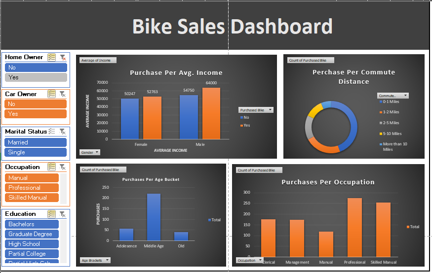

## Data Analysis In Excel and Bike Sales Dashboard 

This project demonstrates data cleaning, analysis, and dashboard creation using Microsoft Excel.

## Key Features
- Data cleaning and preprocessing
- Pivot tables and pivot charts
- Interactive slicers
- Business-focused insights

## Dashboard Insights
- Purchase behavior by income
- Commute distance vs purchase
- Age group and occupation analysis

## Tools Used
- Microsoft Excel

## Preview

